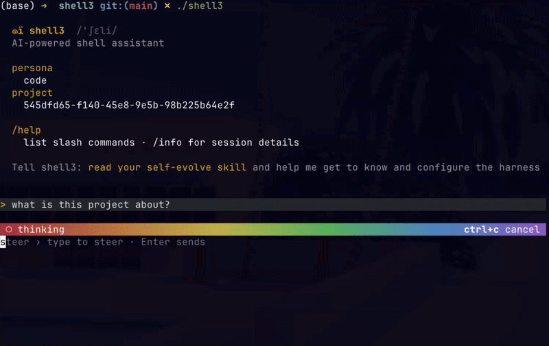

# ๑ï shell3 /'ʃɛli/

A minimal, Unix-composable coding agent. One binary, one Lua config file, any
OpenAI-compatible endpoint.

shell3 puts a language model in your terminal with `bash`, file editing, and
whatever tools you define — then stays out of the way. It pipes like a Unix
tool and is configured like software, not like a platform.



```sh
shell3                                           # interactive session (TUI)
shell3 run "explain the failing test"            # one-shot, prints and exits
git diff | shell3 run                            # stdin is the prompt — pipes like a filter
shell3 run "audit deps" --out audit.jsonl        # headless, with a JSONL audit log
```

## Install

```sh
curl -fsSL https://raw.githubusercontent.com/weatherjean/shell3/main/install.sh | sh
```

This downloads the right prebuilt binary for your OS and architecture and
installs it to `~/.local/bin`. Make sure that directory is on your `PATH`.

Other ways to install:

```sh
go install github.com/weatherjean/shell3/cmd/shell3@latest   # with a Go toolchain
make build                                                   # from a checkout
```

Prebuilt binaries also live on the
[releases page](https://github.com/weatherjean/shell3/releases).

shell3 targets Unix-like systems (Linux, macOS). Windows is not supported — it
leans on Unix process groups and TTY semantics. WSL works.

## Quickstart

```sh
shell3 boot     # asks: endpoint URL, model, name, API key — writes the config
shell3          # start a session
```

`boot` creates `~/.shell3/shell3.lua` (the config, with a `code` and a `plan`
agent), `~/.shell3/lib/` (tools and skills as small Lua modules), and
`~/.shell3/.env` (your secrets — never commit this file).

Inside a session: type to chat, `Tab` to switch agents, `/help` for the slash
commands. Full walkthrough in [docs/cli.md](docs/cli.md).

## Features

- **Any OpenAI-compatible provider.** OpenAI, Ollama, Groq, LM Studio,
  OpenRouter, Moonshot, DeepSeek — with reasoning-trace streaming where vendors
  support it, and a `run_proxy` escape hatch for endpoints that need a local shim.
- **One Lua config.** Models, agents, system prompts, tools, and skills all live
  in `shell3.lua` — versionable, diffable, programmable.
- **Multiple agents, one conversation.** Switch between a full-access `code`
  agent and a read-only `plan` agent (or your own) with `Tab` or `/agent`,
  keeping history.
- **Bash-first, unsafe by default.** The agent acts through `bash`, `read`,
  `list_files`, and `edit_file` — plus `read_media` for images and audio on
  multimodal models; everything else is a command it runs (`read` +
  `list_files` alone make a fully read-only agent that needs no shell). The
  single opt-in hook is `shell3.on_tool_call(fn)` — chainable, verdict-based
  (block / rewrite / runner-swap / ask a human); denylists use `shell3.regex`.
  `read`/`list_files` are ungated by design.
- **Context managed for you.** Set a `compact_at` token threshold and shell3
  auto-compacts the conversation into a summary — no model-driven prune/compact
  tools. History persists as plain JSONL under `.shell3_project/runs/` and is
  searchable from inside a session with `rg`.
- **Headless & auditable.** Pipe in, pipe out; `--out` streams a lossless JSONL
  log of every token, tool call, and result.

## Documentation

- **[Configuration](docs/configuration.md)** — models, agents, custom tools,
  `on_tool_call`, `on_tool_result`, `stub_tools`, skills, proxies.
- **[CLI & headless](docs/cli.md)** — scripting, the `--out` audit log, the
  read-only query commands, slash commands.
- **[Security & data](docs/security.md)** — the threat model, secrets, and
  removing shell3's data.
- **[Cookbook](docs/cookbook/README.md)** — drop-in recipes: extra agents,
  planning skills, the browser skill, proxy and sandbox setups.

## Security

shell3 runs model-chosen shell commands and is **unsafe by default** — a full,
unrestricted shell with no approval prompt until you opt in. The single hook is
`shell3.on_tool_call(fn)`: chainable, verdict-based (block / rewrite / runner-swap /
ask a human via `y/N` in the TUI). Denylists use
`shell3.regex` (Go RE2, compiled at load). Run it in a sandbox, container, or
throwaway user if you need hard isolation, and read
[docs/security.md](docs/security.md) before pointing it at anything you care
about. Report vulnerabilities via
[GitHub Security Advisories](https://github.com/weatherjean/shell3/security/advisories).

## Contributing

See [CONTRIBUTING.md](CONTRIBUTING.md). Short version: `make test` (race detector
on), `make lint`, feature branches, and tests with every behavior change.

## License

[MIT](LICENSE) © 2026 WeatherJean.

Portions of `internal/edittool` are a Go port of the str-replace edit tool from
[opencode](https://github.com/sst/opencode), used under its license; see the
package doc comment in
[internal/edittool/replace.go](internal/edittool/replace.go) for details.
