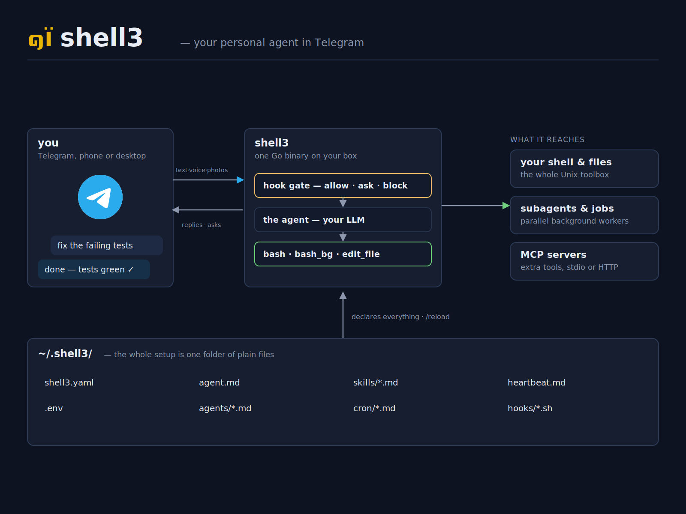

<p align="center">
  
</p>

A minimal, Unix-composable personal agent you run as a **Telegram bot**.
One binary, one config directory of YAML + markdown, any OpenAI-compatible
endpoint.

shell3 is an always-on agent on a host you control: it runs `bash`, edits
files, schedules work, spawns subagents, and ships a Mini App dashboard for
its runs, jobs, and files. It pipes like a Unix tool and is configured like
software, not like a platform.

```sh
shell3 boot        # interactive form: model + endpoint + key, vision, Telegram bot token + chat id
shell3 telegram    # start the bot — now message it from Telegram
```

## How it works

<p align="center">
  
</p>

## Install

```sh
curl -fsSL https://raw.githubusercontent.com/weatherjean/shell3/main/install.sh | sh
```

Installs the right prebuilt binary to `~/.local/bin` (make sure it's on your
`PATH`). Alternatives: `go install github.com/weatherjean/shell3/cmd/shell3@latest`,
`make build` from a checkout, or the
[releases page](https://github.com/weatherjean/shell3/releases).

Unix-like systems only (Linux, macOS — WSL works). Windows is not supported:
shell3 leans on Unix process groups.

## Quickstart

1. Create a bot with [@BotFather](https://t.me/BotFather) and note its token;
   get your numeric chat id (e.g. from [@userinfobot](https://t.me/userinfobot)).
2. `shell3 boot` — fill in the form (it also asks whether your model has
   vision, and wires image handling accordingly). It writes the config tree
   under `~/.shell3/`: `shell3.yaml`, `agent.md`, `agents/`, `skills/`,
   `hooks/`, and `.env`.
3. `shell3 telegram` — the bot connects. Message it.

`boot` scaffolds the agent, a read-only `explorer` subagent, and a
`telegram:` block whose Mini App dashboard is tunneled with
[cloudflared](https://github.com/cloudflare/cloudflared) when installed
(otherwise the dashboard stays local-only). Full walkthrough in
[docs/cli.md](docs/cli.md).

## Commands

| Command | What |
|---------|------|
| `shell3 telegram` | Run the bot + Mini App dashboard (the service). |
| `shell3 web`      | Standalone web front-end (dashboard + chat, token auth) — the Telegram-free fallback. |
| `shell3 boot`     | Scaffold the config + `.env` interactively. |
| `shell3 health`   | Load the config strictly; fail on any warning. |
| `shell3 dev "…"`  | Drive the agent locally, full verbose output; `--resume` continues the last session. |
| `shell3 dash`     | Serve the dashboard locally, no auth (localhost only). |

## Features

- **Talk to it from Telegram.** One authorized chat; inline Allow/Deny buttons
  for gated commands; media in and out; `/stop`, `/reload`, `/run`. The Mini
  App dashboard shows status, past runs, background jobs, cron, and a
  read-only file explorer (`.env` redacted).
- **Voice and images (optional).** `media.stt`/`media.tts` transcribe voice
  notes in and speak replies out (`/voice` picks the mode); `media.describe`
  captions images for text-only models; `media.imagegen` adds an
  `image_generate` tool (`api: openai` or `openrouter`). One free Groq key
  covers speech both ways — see
  [docs/cookbook/voice-images.md](docs/cookbook/voice-images.md).
- **Any OpenAI-compatible provider.** OpenAI, Ollama, Groq, LM Studio,
  OpenRouter, Moonshot, DeepSeek — reasoning-trace streaming where supported,
  and a `run_proxy` escape hatch for endpoints that need a local shim.
- **One config directory, four rules.** YAML wires it (`shell3.yaml`:
  models, Telegram/web, MCP, media); markdown prompts it (`agent.md`,
  `agents/*.md`, `skills/*.md`, `cron/*.md`, `heartbeat.md` — frontmatter +
  body); files enable it (a feature is on because its file exists); one bash
  script gates it. Versionable, diffable, and the agent can edit its own
  config and `/reload` it live.
- **Bash-first, unsafe by default.** The agent acts through `bash` and
  `edit_file` (plus `read_media` for images/audio/PDF/video on multimodal
  models); reading and searching are just commands (`cat`, `ls`, `rg`). The
  opt-in gate is a bash script per agent (`hooks/tool-call.sh`,
  `hooks/<subagent>.tool-call.sh`) — JSON in, verdict out (block / rewrite /
  runner-swap / ask a human over Telegram), fail-closed on script errors.
- **MCP servers (tools only).** The `mcp:` block connects stdio or
  streamable HTTP servers on the official Go SDK; agents opt in per server
  (`mcp: [github]` in their frontmatter), tools surface as
  `mcp_<server>_<tool>`, and calls pass through the same hook gate.
  `shell3 health` and the dashboard report each server's state. No OAuth —
  remote auth is a bearer header from `.env`.
- **Subagents & scheduling.** Drop a file in `agents/` and the `task` tool
  appears — delegate to it fire-and-forget (in-process jobs, completion
  notices); background commands with `bash_bg`; recurring prompts as
  `cron/*.md` files.
- **Heartbeat.** A `heartbeat.md` hands the idle main session a periodic
  checklist; `HEARTBEAT_OK` replies are suppressed, so you only hear real
  alerts.
- **Context managed for you.** A `compact_at` threshold auto-compacts the
  conversation into a summary; history persists as plain JSONL under
  `.shell3_project/runs/`, searchable with `rg`.

## Documentation

- **[Configuration](docs/configuration.md)** — the config directory: models,
  agent, subagents, Telegram/web blocks, cron, heartbeat, voice & images,
  scripts & secrets, MCP servers, hook scripts, skills.
- **[CLI](docs/cli.md)** — every subcommand and the JSONL runs store.
- **[Security & data](docs/security.md)** — threat model, secrets, wiping data.
- **[Cookbook](docs/cookbook/README.md)** — drop-in recipes: subagents,
  skills, proxies, sandboxes.

## Security

shell3 is **unsafe by default**: model-chosen commands run in a full,
unrestricted shell until you write a `hooks/tool-call.sh` gate. The bot answers
exactly one chat id. Run it in a container, VM, or throwaway user for hard
isolation, and read [docs/security.md](docs/security.md) before pointing it at
anything you care about. Report vulnerabilities via
[GitHub Security Advisories](https://github.com/weatherjean/shell3/security/advisories).

## Contributing

See [CONTRIBUTING.md](CONTRIBUTING.md): `make test` (race detector on),
`make lint`, feature branches, tests with every behavior change.

## License

[MIT](LICENSE) © 2026 WeatherJean.

Portions of `internal/edittool` are a Go port of
[opencode](https://github.com/sst/opencode)'s str-replace edit tool, used
under its license; see [internal/edittool/replace.go](internal/edittool/replace.go).
