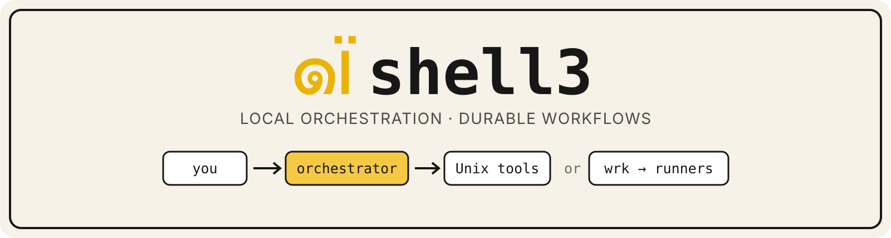
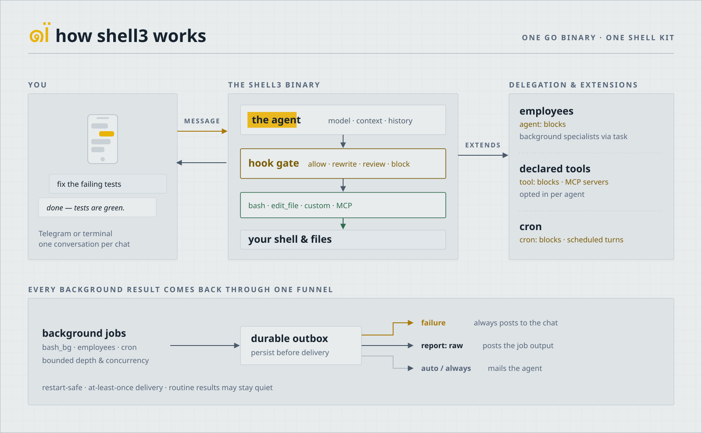

<p align="center">
  
</p>

A minimal, Unix-composable personal agent you run **on your own box** and
reach over **Telegram**. One binary, one config directory of YAML + markdown,
any OpenAI-compatible endpoint.

The one agent you message is your single point of contact: it triages every
request, handles small things itself, and delegates the rest to project
managers and subagents. It runs `bash`, edits files, schedules work, and
answers in one Telegram chat — yours.

```sh
shell3 boot        # interactive form: model + endpoint + key, vision, bot token, workdir
shell3 telegram    # connects the bot and listens — message it
```

## How it works

<p align="center">
  
</p>

## Install

```sh
curl -fsSL https://raw.githubusercontent.com/weatherjean/shell3/main/install.sh | sh
```

Installs the right prebuilt binary to `~/.local/bin` (make sure it's on your
`PATH`). Alternatives: `go install github.com/weatherjean/shell3/cmd/shell3@latest`,
`make build` from a checkout, or the
[releases page](https://github.com/weatherjean/shell3/releases).

Unix-like systems only (Linux, macOS — WSL works). Windows is not supported:
shell3 leans on Unix process groups.

## Update

Run the install command again — it overwrites the binary; your config
(`~/.shell3/`) and history are untouched. A running bot keeps executing
the old binary until restarted (`systemctl --user restart shell3.service`
when running as a service, otherwise restart `shell3 telegram`).
`shell3 --version` confirms what you're on; pin a release with
`curl -fsSL … | VERSION=vX.Y.Z sh`. If you installed via `go install`,
update the same way.

**Breaking:** the web interface is gone and `web:` is no longer a known key, so a config carrying one fails the strict load. Replace the block
with `telegram: {token, chat_id, workdir}` (see
[docs/configuration.md](docs/configuration.md#telegram--telegram)), or re-run
`shell3 boot --force`, which rewrites the scaffolded files.

## Quickstart

1. Get a bot token from [@BotFather](https://t.me/BotFather) and your numeric
   chat id from [@userinfobot](https://t.me/userinfobot).
2. `shell3 boot` — fill in the form (model endpoint + key, vision, context
   budget, the token and chat id, workdir). It writes the config tree under
   `~/.shell3/` (`shell3.yaml`, `agent.md`, `notifier.md`, `memory.md`,
   `agents/`, `skills/`, `cron/`, `hooks/`, `.env`). On Linux with systemd it
   offers to install and start a user service.
3. `shell3 telegram` — the bot greets the chat and listens.

Nothing is exposed: shell3 makes outbound connections to Telegram, so there is
no port to open and no tunnel to run. The bot answers exactly one `chat_id`;
messages from anywhere else are ignored. Full walkthrough in
[docs/cli.md](docs/cli.md).

## Commands

| Command | What |
|---------|------|
| `shell3 telegram` | Run the bot front-end + cron (the service). |
| `shell3 boot`     | Scaffold the config + `.env` interactively. |
| `shell3 project new` | Scaffold a `projects/<name>/` config dir (brief + manager). |
| `shell3 health`   | Load the config strictly; fail on any warning. |
| `shell3 ask "…"`  | Ask the agent locally, full verbose output; no message = an interactive multi-turn loop; `-p` for headless scripting; `--resume` continues the last session. |

Every subcommand takes `--config/-c` to point at a different config directory.

## Features

- **A Telegram bot as the front-end** — one chat, one agent. Every message
  starts a fresh thread; replying to one of its messages continues that
  thread's session. `/status`, `/jobs`, `/job`, `/cancel`, `/cron`, `/runs`,
  `/run`, `/reload`, `/stop`, `/voice` are answered without a model call.
- **Bash-first, gated by a script you own** — the agent acts through `bash`
  and `edit_file`; a per-agent hook script allows, rewrites, asks, or blocks
  every tool call. Fail-closed, and armed out of the box.
- **Chain of command** — the agent triages, does small things itself, and
  delegates the rest to project managers (`shell3 project new`) and
  subagents.
- **One config directory, four rules** — YAML wires it, markdown prompts it,
  files enable it, one bash script gates it. Versionable, diffable,
  reloadable live; the gate scripts and `.env` stay the operator's.
- **Subagents & scheduling** — fire-and-forget `task` delegation, `bash_bg`
  background commands, `cron/*.md` schedules. A notifier triages every
  completion: post it to the chat, wake the agent, or stay silent; failures
  always surface.
- **Any OpenAI-compatible provider** — OpenAI, Ollama, Groq, LM Studio,
  OpenRouter, Moonshot, DeepSeek, …
- **MCP servers** — stdio or streamable HTTP, opt-in per agent, gated like
  every other tool.
- **Voice and images (optional)** — voice notes are transcribed, replies can
  come back spoken (`/voice`), inbound photos are captioned, and
  `image_generate` sends its result to the chat; one free Groq key covers
  speech both ways
  ([docs/cookbook/voice-images.md](docs/cookbook/voice-images.md)).
- **Context managed for you** — auto-compaction past a threshold; history is
  plain JSONL you can `rg`.

## Documentation

- **[Configuration](docs/configuration.md)** — the config directory: models,
  agent, subagents, projects, the telegram block, cron, voice & images,
  scripts & secrets, MCP servers, hook scripts, skills.
- **[CLI](docs/cli.md)** — every subcommand and the JSONL runs store.
- **[Security & data](docs/security.md)** — threat model, secrets, wiping data.
- **[Cookbook](docs/cookbook/README.md)** — drop-in recipes: subagents,
  skills, proxies, sandboxes.

## Security

shell3 gives the model a full, unrestricted shell, limited only by the
`hooks/tool-call.sh` gate — which a scaffolded config **ships armed**:
credentials, system paths, unread remote code (`curl … | sh`), publishing,
force-pushes, and anything that would kill shell3 itself are refused, while
ordinary work runs untouched. Read it and tune it to your deployment.
The bot answers one `chat_id` and the token lives in `.env`, so access control
is Telegram's: whoever controls that chat — or that token — has that shell.
The gate script, not the chat, is what limits what can happen. Use a
container, VM, or throwaway user for hard isolation, and read
[docs/security.md](docs/security.md) first. Report
vulnerabilities via
[GitHub Security Advisories](https://github.com/weatherjean/shell3/security/advisories).

## Contributing

See [CONTRIBUTING.md](CONTRIBUTING.md): `make test` (race detector on),
`make lint`, feature branches, tests with every behavior change.

## License

[MIT](LICENSE) © 2026 WeatherJean.

Portions of `internal/edittool` are a Go port of
[opencode](https://github.com/sst/opencode)'s str-replace edit tool, used
under its license; see [internal/edittool/replace.go](internal/edittool/replace.go).
